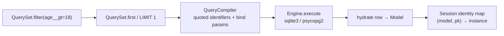

# PyORM

A production-shaped Object-Relational Mapper written from scratch in Python. It does **not** wrap SQLAlchemy, Django ORM, or Peewee. The only third-party (optional) dependency is `psycopg2` for PostgreSQL; SQLite uses the stdlib `sqlite3` driver.

Built as a portfolio project to make the usual ORM internals *visible*: metaclasses, descriptors, lazy QuerySets, a Unit of Work, an identity map, and a migration differ.

## Why it exists

Interviewers do not care that you can call `session.query(User)`. They care whether you can explain:

- why a QuerySet is lazy
- why `order.customer` is a descriptor
- why that causes the N+1 problem and how `select_related` fixes it
- why a Session exists (identity map + transaction boundary + dirty fields)
- how parameterized SQL stops injection without an ORM “magic” story

PyORM is small enough to read in an afternoon and complete enough to defend.

## Installation

```bash
python -m venv .venv
.venv\Scripts\activate        # Windows
pip install -e ".[dev]"
```

PostgreSQL (optional):

```bash
pip install -e ".[postgres]"
```

## Quickstart

```python
from datetime import datetime, timezone
from pyorm import (
    CharField, DateTimeField, ForeignKey, IntegerField, Model, Session, configure, create_all,
)

configure("sqlite:///:memory:")

class User(Model):
    name = CharField(max_length=80)
    age = IntegerField(default=0)

class Order(Model):
    customer = ForeignKey(User, related_name="orders")
    created_at = DateTimeField(default=lambda: datetime.now(timezone.utc))

create_all()

with Session() as session:
    ada = User(name="Ada", age=36)
    session.add(ada)
    session.commit()
    session.add(Order(customer=ada))

    adults = session.query(User).filter(age__gt=18).order_by("-name").all()
    order = session.query(Order).select_related("customer").first()
    print(order.customer.name)   # no extra query — already joined
```

Lookups: `__gt`, `__gte`, `__lt`, `__lte`, `__contains`, `__in`, `__isnull` (default is exact match).

Migrations:

```bash
pyorm makemigrations --models examples.blog_demo --db sqlite:///blog.db
pyorm migrate --db sqlite:///blog.db
pyorm migrate --rollback --db sqlite:///blog.db
```

Demo (prints query counts, JOIN SQL, and dirty-field UPDATE SQL):

```bash
python -m examples.blog_demo
```

Tests:

```bash
pytest --cov=pyorm --cov-report=term-missing
```

Benchmark (honest ORM vs raw sqlite3):

```bash
python benchmarks/benchmark.py
```

## Architecture (how `.filter().first()` runs)



ASCII:

```
User.objects.filter(age__gt=18).first()
        │
        ▼
  QuerySet  (still no SQL — clone with a WhereNode)
        │  .first()  →  terminal
        ▼
  QueryCompiler  SELECT ... WHERE "t0"."age" > ?   params=[18]
        │
        ▼
  Engine / connection pool  (dialect picks ? vs %s)
        │
        ▼
  hydrate + identity map  →  User instance
```

Design decisions and tradeoffs vs SQLAlchemy / Django: see [ARCHITECTURE.md](ARCHITECTURE.md).
